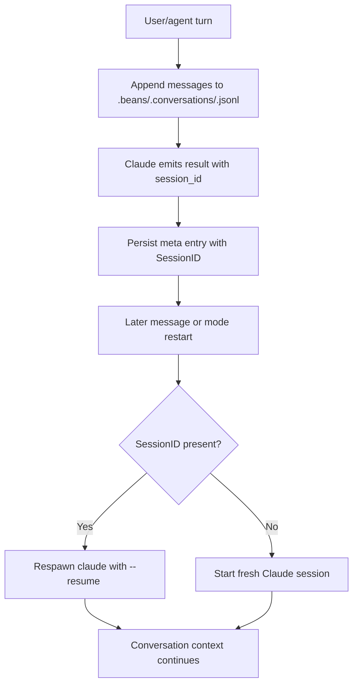

# Use-case: session persistence and resume

## What it is

Beans keeps agent conversations durable so a bean chat can continue across turns, process restarts, and mode switches.

This is a core Claude-backed use-case because the current implementation depends on Claude session IDs and `--resume`.

## How Beans uses Claude for it

1. Beans stores conversation history in:
   - `.beans/.conversations/<beanID>.jsonl`
2. It appends persisted message entries for user, assistant, tool, and info messages.
3. When Claude emits a `result` event with a `session_id`, Beans stores that value on the session and persists it as a JSONL `meta` entry.
4. On a later turn, if `SessionID` is present, Beans respawns Claude with:
   - `--resume <sessionID>`
5. The resumed Claude process continues the same conversation context instead of starting from scratch.

## Where Beans relies on this

- normal multi-turn chat continuity
- resuming after the process was stopped
- switching modes and restarting the process without losing context
- preserving pending conversations after graceful shutdown

## Claude-specific behavior in this use-case

- `SessionID` is a Claude concept in the current implementation.
- Resume depends on Claude's CLI flag `--resume`.
- Process shutdown tries to be graceful so Claude has a chance to persist resumable state before Beans kills it.
- Session materialization from disk assumes old persisted sessions are Claude sessions.

## Important flow details

### Stop

`StopSession(beanID)` stops the running process but keeps the stored session and conversation history.

### Clear

`ClearSession(beanID)` deletes the JSONL conversation first, then removes the in-memory session, then stops any running process.

### Shutdown

`Manager.Shutdown()` kills all running Claude processes concurrently, but the persistence model is still based on Claude-compatible resume state.

## Flow diagram

## Relevant files

- `internal/agent/manager.go`
- `internal/agent/store.go`
- `internal/agent/claude.go`
- `internal/agent/types.go`
- `internal/graph/schema.resolvers.go`
