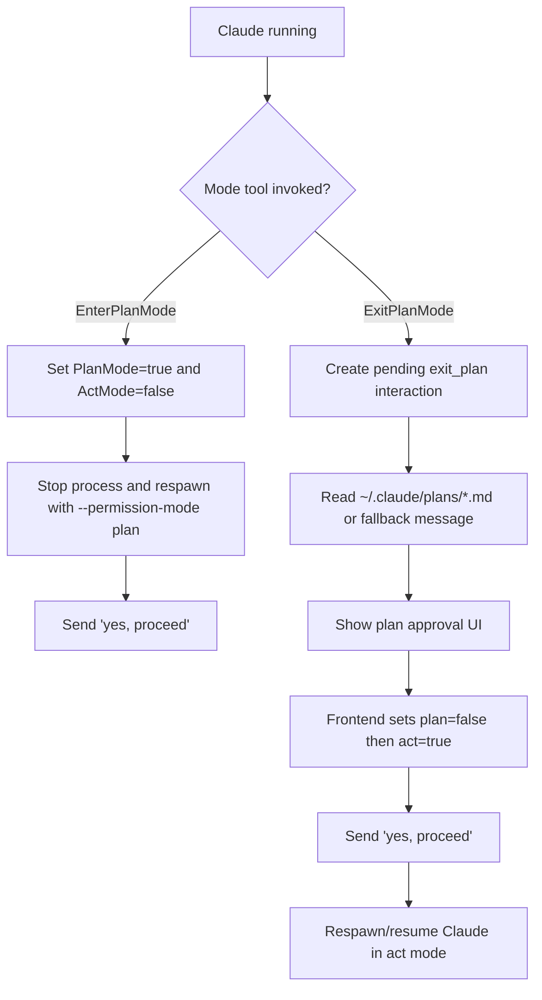

# Use-case: plan mode and plan approval

## What it is

Beans exposes a planning workflow where the agent can operate in a read-only planning mode and then transition into implementation mode after approval.

Today this behavior is built directly on Claude-specific mode concepts and tool names.

## How Beans uses Claude for it

### Startup flags

When Beans spawns Claude, it chooses mode-related flags from session state:

- `PlanMode == true` -> `--permission-mode plan`
- `ActMode == true` -> `--dangerously-skip-permissions`
- if both are true, act mode wins

### Entering plan mode

1. Claude invokes `EnterPlanMode`.
2. Beans treats this as auto-approved.
3. It toggles session state to:
   - `PlanMode = true`
   - `ActMode = false`
4. Beans stops the current process.
5. Beans immediately respawns Claude with `--resume <sessionID>` and the new plan-mode flag.
6. It sends `yes, proceed` as a normal follow-up user message.

### Exiting plan mode

1. Claude invokes `ExitPlanMode`.
2. Beans creates a pending interaction:
   - `PendingInteraction.Type = exit_plan`
3. Beans tries to attach plan content to that interaction.
4. To find the plan, it scans recent tool invocations for a `Write` to:
   - `~/.claude/plans/*.md`
5. If it cannot find a plan file, it falls back to the last non-empty assistant message.
6. Beans stops the current process, preserving resumable session state.
7. The frontend shows the plan and offers approval or freeform refinement.

## Frontend approval path

The current UI has a very specific sequence:

1. `setPlanMode(beanId, false)`
2. `setActMode(beanId, true)`
3. `sendAgentMessage(beanId, "yes, proceed")`

The ordering matters because the resumed Claude process must start with the act-mode flag already applied.

## Claude-specific behavior in this use-case

- uses Claude flags `--permission-mode plan` and `--dangerously-skip-permissions`
- depends on Claude tool names `EnterPlanMode` and `ExitPlanMode`
- depends on Claude resume behavior for process restarts
- assumes plan artifacts may live under `~/.claude/plans/`

## Why it matters

This is not just runtime coupling. The session model, GraphQL mutations, and frontend controls are all designed around Claude's plan/act workflow.

## Flow diagram

## Relevant files

- `internal/agent/claude.go`
- `internal/agent/manager.go`
- `internal/agent/types.go`
- `frontend/src/lib/components/AgentChat.svelte`
- `frontend/src/lib/components/PendingInteraction.svelte`
- `internal/graph/schema.graphqls`
