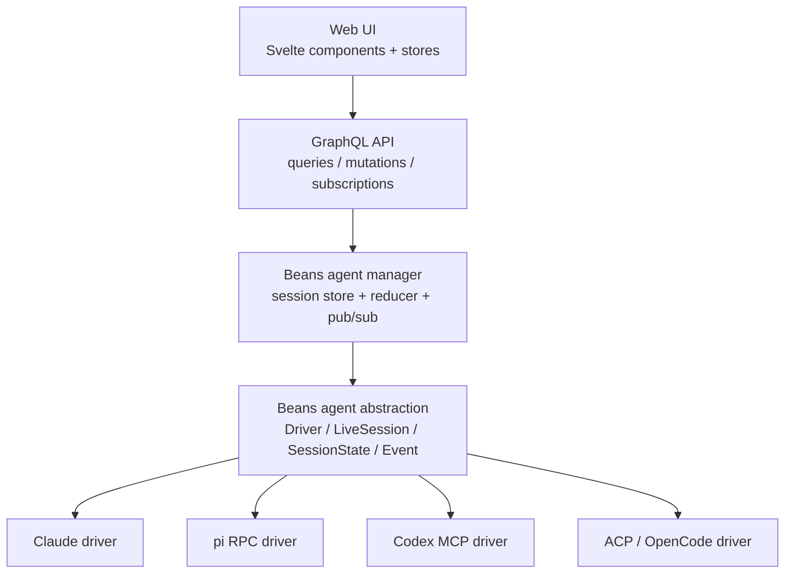

# Beans agent spec

A minimal Beans-native API for integrating different coding agents.

Goals:

- one internal abstraction for Claude, pi RPC, Codex MCP, ACP/OpenCode
- one UI-facing session model
- interactions are session state, not host callbacks
- ACP-style host execution needs stay optional and backend-only

---

## 0. Stack position



Reading it top to bottom:

- the Web UI only knows the GraphQL session model
- GraphQL talks to the Beans agent manager
- the manager owns the canonical session state and reduces driver events into it
- the abstraction is the boundary between Beans core and concrete agent runtimes
- each concrete driver adapts one external protocol/runtime into the same Beans model

---

## 1. Design rules

1. Beans owns the session model.
2. Drivers adapt external protocols into Beans events.
3. The UI talks only to Beans session state.
4. User interactions are emitted as session events/state and answered later.
5. Host execution requirements are optional and driver-specific.
6. The core should model what Beans already uses today; richer features can be added later.

---

## 2. Core interfaces

```go
type Driver interface {
    Kind() string
    HostCapabilityRequirements() HostCapabilityRequirements
    Open(ctx context.Context, req OpenSessionRequest) (LiveSession, error)
    Resume(ctx context.Context, req ResumeSessionRequest) (LiveSession, error)
}

type LiveSession interface {
    Events() <-chan Event

    Send(ctx context.Context, input UserInput, opts SendOptions) error
    Cancel(ctx context.Context) error
    SetMode(ctx context.Context, modeID string) error
    Respond(ctx context.Context, requestID string, reply InteractionReply) error

    Close(ctx context.Context) error
}
```

Notes:

- `SetMode` may be unsupported by a driver.
- `Respond` is for pending interaction requests.
- Operational extras like compaction/model switching are **not** core yet.

---

## 3. Open/resume inputs

```go
type OpenSessionRequest struct {
    BeansSessionID string
    WorkingDir     string
    InitialModeID  string // default: "act"
    Context        []ContentBlock
    Meta           map[string]any
}

type ResumeSessionRequest struct {
    BeansSessionID string
    WorkingDir     string
    Resume         ResumeState
    Meta           map[string]any
}

type ResumeState struct {
    DriverKind string
    Opaque     map[string]any
}
```

`ResumeState` is adapter-owned.
Examples:

- Claude: session ID
- ACP: ACP session ID
- pi RPC: session file/session ID
- Codex MCP: thread ID

---

## 4. Session state

```go
type SessionState struct {
    BeansSessionID  string
    DriverKind      string
    Status          SessionStatus
    WorkDir         string

    Capabilities    SessionCapabilities
    CurrentModeID   string
    AvailableModes  []Mode

    Messages        []Message
    ToolCalls       []ToolCall
    PendingRequests []InteractionRequest

    StatusText      string
    LastError       string
    Resume          *ResumeState
}
```

Notes:

- `CurrentModeID` replaces `planMode` / `actMode`
- `PendingRequests` replaces Claude-specific pending interaction state
- `ToolCalls` stay in the spec because current Beans already surfaces tool-like activity, diffs, and progress; if needed, this can still be omitted in an initial implementation and added right after

---

## 5. Minimal event model

Drivers emit normalized events; Beans reduces them into `SessionState`.

Core events:

- `ResumeStateUpdated`
- `SessionStatusChanged`
- `ModesUpdated`
- `StatusTextUpdated`
- `MessageStarted`
- `MessageDelta`
- `MessageCompleted`
- `ToolCallStarted`
- `ToolCallUpdated`
- `ToolCallCompleted`
- `InteractionRequested`
- `InteractionResolved`
- `ErrorEvent`
- `SessionEnded`

Everything else should be added only when a real driver needs it.

---

## 6. Capabilities

### UI-facing session capabilities

```go
type SessionCapabilities struct {
    Resume      bool
    SetMode     bool
    CancelTurn  bool
    SendImages  bool
    ToolCalls   bool
    Interaction bool
}
```

### Backend-only host requirements

```go
type HostCapabilityRequirements struct {
    FileSystem  bool
    Terminal    bool
    Permissions bool
}
```

This is not core UI API.
It is backend plumbing for drivers like ACP.

---

## 7. Interactions

Interactions are session state, not synchronous host callbacks.

Flow:

1. driver emits `InteractionRequested`
2. Beans stores it in `PendingRequests`
3. UI renders it
4. user answers
5. Beans calls `Respond(requestID, reply)`

Interaction kinds should include:

- `permission`
- `confirm`
- `select`
- `multi_select`
- `text_input`
- `editor`
- `custom`

---

## 8. Modes

```go
type Mode struct {
    ID          string
    Name        string
    Description string
}
```

Rules:

- default mode is `act`
- if a driver has no native mode system, expose:
  - `currentModeId = "act"`
  - `availableModes = [act]`
  - `SetMode = false`

This applies to pi RPC and Codex MCP.

---

## 9. Driver mapping summary

### Claude
- native session + streaming adapter
- modes: `plan`, `act`
- no host requirements

### pi RPC
- prompt/steer/follow_up mapping can be added later as optional delivery behavior
- always expose `act`
- no host requirements

### Codex MCP
- `codex` = open
- `codex-reply` = continue
- always expose `act`
- no host requirements
- resume state is process-local thread ID

### ACP / OpenCode
- session-based adapter
- may expose native modes
- requires host capabilities for FS / terminal / permissions
- permission requests still map into normal `InteractionRequested` state

---

## 10. Likely future extensions

Add only when needed by a real driver/UI feature:

- plans
- commands
- direct runtime actions (compact, set model, thinking level, etc.)
- richer runtime capability objects
- ACP-specific open/session config beyond `Meta`

---

## 11. Non-goals

This spec does **not** make Beans:

- ACP-shaped internally
- Claude-shaped internally
- a generic editor-host protocol implementation

Beans remains a session manager and UI adapter with pluggable drivers.
