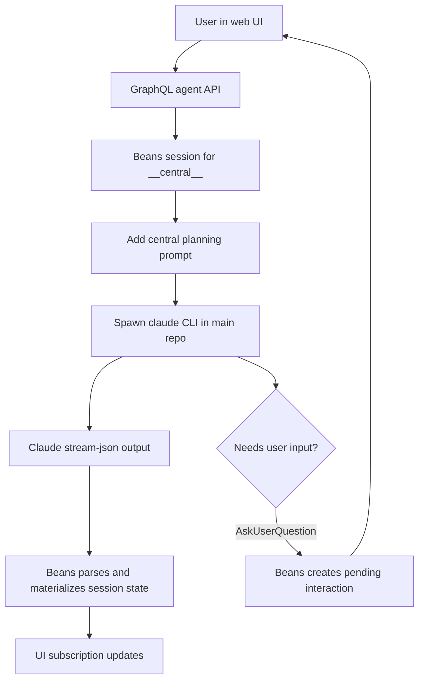

# Use-case: central planning agent

## What it is

Beans has a special central agent session with the ID `__central__`. This is the planning and coordination agent for the main repository.

It is not meant to implement bean work directly. Instead, it helps the user:

- create and refine beans
- organize backlog structure
- prioritize and relate work
- start implementation work by creating worktrees

## How Beans uses Claude for it

1. The web UI talks to the generic GraphQL agent API:
   - `agentSession(beanId)`
   - `sendAgentMessage(beanId, message, images)`
   - `stopAgent(beanId)`
2. For `beanId == __central__`, Beans creates an agent session whose working directory is the main repo.
3. When the session needs a Claude process, Beans spawns the `claude` CLI directly.
4. The first message is prefixed with a central planning prompt from `internal/commands/serve.go`.
5. That prompt tells Claude to:
   - behave as the planning agent
   - avoid Claude's built-in worktree tools
   - use Beans GraphQL `startWork` instead
   - use `AskUserQuestion` instead of plain-text questions
6. Claude output is parsed from `stream-json` stdout and materialized into the shared session state used by GraphQL subscriptions.

## Claude-specific behavior in this use-case

- Beans depends on Claude CLI process spawning.
- Beans depends on Claude `stream-json` stdin/stdout.
- The prompt explicitly references Claude-specific tools such as `EnterWorktree` and `AskUserQuestion`.
- Interactive questions only work because Beans intercepts Claude tool calls and turns them into UI interactions.

## Why this is a distinct use-case

The central agent is different from worktree agents because it is a coordination surface, not a coding surface. Its Claude prompt and allowed behavior are specialized for planning.

## Flow diagram

## Relevant files

- `internal/commands/serve.go`
- `internal/agent/manager.go`
- `internal/agent/claude.go`
- `internal/graph/schema.graphqls`
- `frontend/src/lib/components/AgentChat.svelte`

## Assessment against `meta/bjesuiter/04-spec/beans-agent-spec.md`

**Verdict:** mostly simplified, but not fully solved.

The new spec would cleanly remove most of the Claude-specific runtime coupling in this use-case:

- the central planner would become just another Beans session with a chosen `DriverKind`
- the manager would own canonical session state instead of Claude-shaped state
- `AskUserQuestion`-style prompts would map to generic `PendingRequests` plus `Respond(...)`
- the UI could stay generic and stop depending on Claude-specific tool names

What the spec does **not** solve by itself is the planning policy for the central agent:

- the central planning prompt still has to exist
- Beans still has to decide that `__central__` is a planning/coordinator session
- worktree-specific instructions like using `startWork` remain product logic above the abstraction

So this use-case becomes much cleaner at the runtime/protocol layer, but its planning behavior is still a Beans-level convention, not something the spec replaces.
