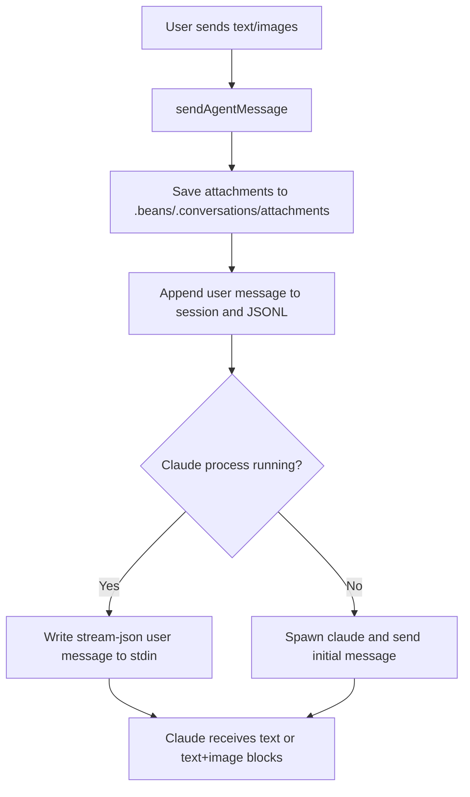

# Use-case: multimodal message input

## What it is

Beans lets the user send plain text prompts and optional image attachments to the agent chat.

This currently works through Claude's input protocol.

## How Beans uses Claude for it

1. The frontend calls `sendAgentMessage(beanId, message, images)`.
2. If images are present, Beans saves them under:
   - `.beans/.conversations/attachments/<beanID>/<uuid>.<ext>`
3. Beans appends the user message to session history and persists it.
4. If Claude is already running, Beans writes the new message to the current process stdin.
5. Otherwise, Beans spawns a new Claude process and sends the message as the initial prompt.
6. Beans writes one JSON object per line using Claude's `stream-json` input format.

## Message shapes

### Text only

```json
{
  "type": "user",
  "message": {
    "role": "user",
    "content": "plain text"
  }
}
```

### Text plus images

When images are attached, Beans switches to Anthropic-style content blocks and base64-inlines the images:

```json
{
  "type": "user",
  "message": {
    "role": "user",
    "content": [
      { "type": "text", "text": "Please inspect this screenshot" },
      {
        "type": "image",
        "source": {
          "type": "base64",
          "media_type": "image/png",
          "data": "..."
        }
      }
    ]
  }
}
```

## Claude-specific behavior in this use-case

- Beans always writes Claude-compatible `type: "user"` JSONL messages.
- Attached images are encoded in Anthropic content-block format.
- Sending follow-up messages to an already-running process depends on Claude's stream interleaving behavior.

## Constraints

- supported image types: JPEG, PNG, GIF, WebP
- max attachment size: 5 MB
- attachments are later served back to the frontend from `/api/attachments/<beanID>/<imageID>`

## Flow diagram



## Relevant files

- `internal/agent/manager.go`
- `internal/agent/claude.go`
- `internal/agent/store.go`
- `frontend/src/lib/agentChat.svelte.ts`

## Assessment against `meta/bjesuiter/04-spec/beans-agent-spec.md`

**Verdict:** partially solved and moderately simplified.

The new spec helps by moving message sending behind a generic session API:

- the UI would send normal Beans `UserInput` through `Send(...)`
- session capabilities can declare whether a driver supports images via `SendImages`
- the Claude driver would be responsible for translating Beans input into Anthropic/Claude wire format

That means the UI and manager would no longer need to think in Claude `stream-json` message envelopes or Anthropic image blocks.

What the spec does **not** fully define yet:

- the exact generic content-block/input shape for sent messages
- attachment persistence conventions
- attachment serving and cleanup rules

So the spec clearly simplifies the API boundary and removes Claude-specific transport assumptions, but Beans still needs additional concrete design for the cross-driver message payload model and for attachment storage behavior.
