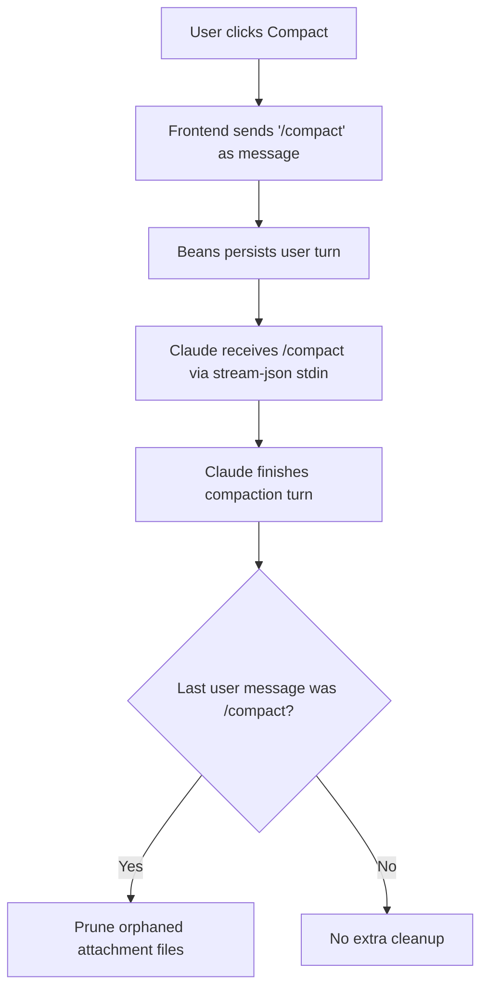

# Use-case: conversation compaction

## What it is

Beans lets the user compact an agent conversation from the web UI.

Today this is implemented as a Claude text command, not as a dedicated API.

## How Beans uses Claude for it

1. The frontend Compact control sends a normal user message:
   - `/compact`
2. Beans persists that message like any other user turn.
3. The message is sent to Claude through the standard `stream-json` stdin flow.
4. Claude handles the compaction internally.
5. When the turn completes, Beans checks whether the last user message was `/compact`.
6. If so, Beans prunes orphaned attachment files that are no longer referenced by persisted messages.

## Claude-specific behavior in this use-case

- Compaction is triggered by the literal command `/compact`.
- There is no separate GraphQL mutation like `compactAgentSession`.
- Beans assumes Claude understands that command and performs compaction semantics behind the scenes.

## Side effect: attachment cleanup

Compaction has a Beans-specific follow-up behavior:

- attachments live under `.beans/.conversations/attachments/<beanID>/`
- after compaction, Beans removes attachment files not referenced by any remaining persisted message

So the user-visible compact action is part Claude behavior and part Beans persistence hygiene.

## Flow diagram

## Relevant files

- `frontend/src/lib/components/AgentChat.svelte`
- `internal/agent/claude.go`
- `internal/agent/store.go`
- `meta/bjesuiter/01-research/claude-code-touchpoints.md`

## Assessment against `meta/bjesuiter/04-spec/beans-agent-spec.md`

**Verdict:** not solved by the current spec.

The spec explicitly leaves operational extras like compaction out of the core abstraction for now:

- `Send(...)`, `SetMode(...)`, and `Respond(...)` are core
- compaction is listed under likely future extensions / direct runtime actions

That means the new spec does **not** yet provide a first-class generic replacement for the current `/compact` behavior.

What the spec would still improve indirectly:

- the UI would no longer need to be Claude-shaped in other areas
- compaction could later be added as an optional runtime action instead of a magic text message
- attachment pruning could remain a Beans-side post-action concern

But as written today, this use-case still needs either:

- a driver-specific convention, or
- a future extension to the spec

So compaction remains one of the clearest examples of functionality that is intentionally out of scope in the current Beans agent spec.
