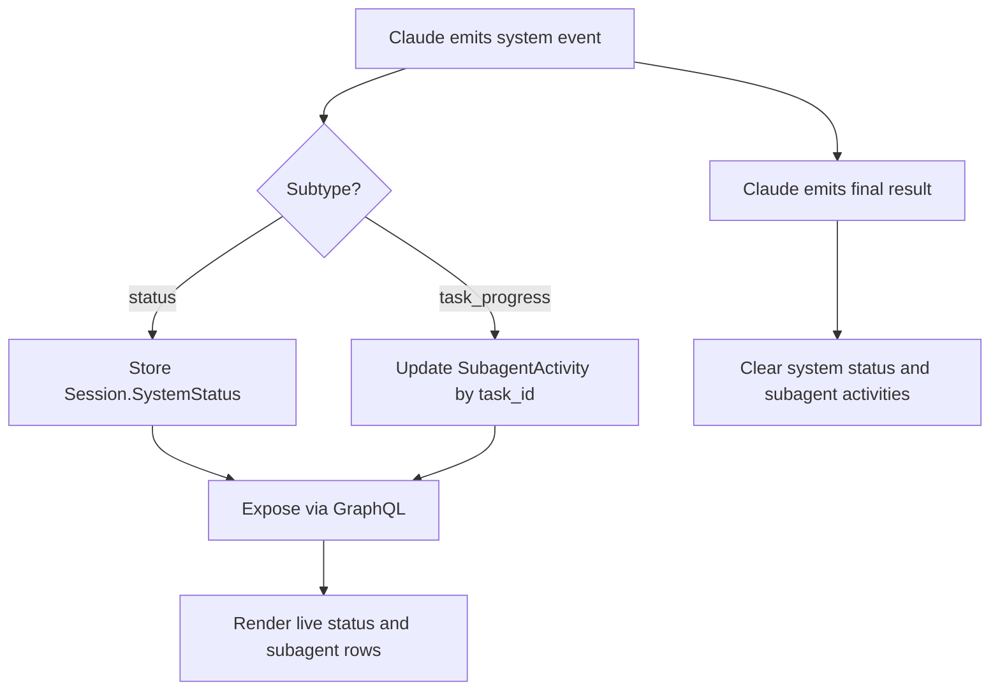

# Use-case: subagent activity and system status

## What it is

Beans shows live agent activity while Claude is running, including a high-level status string and per-subagent progress rows.

## How Beans uses Claude for it

### System status

1. Claude may emit a top-level `system` event with subtype `status`.
2. Beans stores the status text on `Session.SystemStatus`.
3. GraphQL exposes it as `systemStatus`.
4. The frontend uses it to show activity text such as a current phase instead of a generic thinking phrase.

### Subagent activity

1. Claude may emit a top-level `system` event with subtype `task_progress`.
2. Beans parses fields like:
   - `task_id`
   - `description`
   - `last_tool_name`
3. Beans updates or creates a `SubagentActivity` entry keyed by `task_id`.
4. GraphQL exposes the list as `subagentActivities`.
5. The chat UI renders these as live progress items while the session is running.

### Turn completion

When Claude emits a final `result`, Beans clears:

- `SystemStatus`
- `SubagentActivities`

and returns the session to idle.

## Claude-specific behavior in this use-case

- Beans assumes Claude emits `system.status` events.
- Beans assumes Claude emits `system.task_progress` events.
- The shape of `SubagentActivity` is derived from Claude's event payload, not from a generic activity model.

## Why it matters

This is another place where generic API naming hides Claude-specific semantics. The UI looks generic, but the live activity feed is built from Claude event types and Claude progress payloads.

## Flow diagram

## Relevant files

- `internal/agent/parse.go`
- `internal/agent/claude.go`
- `internal/agent/types.go`
- `internal/graph/agent_helpers.go`
- `frontend/src/lib/components/AgentChat.svelte`

## Assessment against `meta/bjesuiter/04-spec/beans-agent-spec.md`

**Verdict:** mostly solved, though some subagent detail remains convention-based.

The spec gives this use-case a much better generic home:

- `StatusTextUpdated` replaces Claude-specific `system.status`
- `ToolCallStarted` / `ToolCallUpdated` / `ToolCallCompleted` provide a generic stream for active work
- `ToolCalls` remain in `SessionState`, specifically because Beans already surfaces tool-like activity and progress

That means the UI can render live activity from generic Beans events instead of from Claude-only event names like `task_progress`.

The remaining gap is that the current UI talks about "subagents," while the spec talks more generally about tool calls and status updates. In practice this is probably good enough for the initial refactor, but if Beans later wants a richer distinction between:

- top-level tool calls
- delegated subagents
- background tasks

then the model may need a future refinement.

So the new spec largely solves the Claude coupling here, even if some of the exact semantics of "subagent activity" stay a matter of driver mapping and UI convention.
