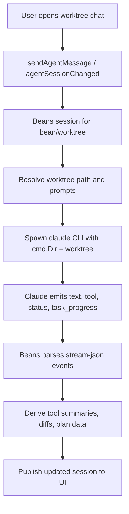

# Use-case: worktree implementation agent

## What it is

Each bean-specific workspace can have its own agent chat. This agent runs inside the bean's git worktree and is the place where implementation work happens.

Typical responsibilities:

- inspect code in the worktree
- edit files for the bean
- run commands in the worktree
- report progress back in the chat UI

## How Beans uses Claude for it

1. The user opens a bean workspace chat in the web UI.
2. The frontend subscribes to `agentSessionChanged(beanId)` and sends prompts with `sendAgentMessage`.
3. The backend resolves the bean's worktree path and stores it as `Session.WorkDir`.
4. Beans spawns `claude` with that directory as `cmd.Dir`.
5. On the first spawned turn, Beans prepends bean-specific context, including:
   - bean ID and title
   - type, status, priority
   - description/body
   - instructions to stay inside the current worktree
   - instructions to use `AskUserQuestion` for user interaction
6. Beans also injects a system prompt that persists across resumed turns and reminds Claude which worktree it is in.
7. Claude emits streaming assistant text, tool-use events, status events, and task progress; Beans parses those and republishes them through the generic agent session model.

## Claude-specific behavior in this use-case

- The worktree agent is still a raw `claude` CLI process.
- Beans disables Claude's built-in worktree switching tools with `--disallowedTools EnterWorktree ExitWorktree`.
- Beans relies on Claude tool-use stream events to render tool messages in the UI.
- The worktree chat UX assumes Claude-specific interactions like plan mode, act mode, and `AskUserQuestion`.

## Extra implementation details

While Claude is working, Beans derives additional UI data from Claude tool input:

- tool message summaries from fields like `description`, `file_path`, or `command`
- write diffs for `Write` tool calls
- plan file discovery for plan approval flows

That means the worktree coding experience depends not just on Claude text output, but on Claude's tool stream structure.

## Flow diagram

## Relevant files

- `internal/commands/serve.go`
- `internal/agent/claude.go`
- `internal/agent/parse.go`
- `internal/agent/types.go`
- `frontend/src/lib/components/AgentChat.svelte`
- `frontend/src/lib/components/AgentComposer.svelte`

## Assessment against `meta/bjesuiter/03-spec/beans-agent-spec.md`

**Verdict:** significantly simplified.

This is one of the use-cases the new spec helps most.

The spec would simplify it by:

- making the worktree chat a generic `SessionState` instead of a Claude-shaped session
- moving runtime differences behind a driver boundary
- representing messages, status text, tool calls, interactions, and resume state in one Beans-native model
- letting the UI render the same session shape regardless of whether the runtime is Claude, pi, Codex, or ACP

It also fits the worktree flow well because the spec already includes:

- `WorkingDir` on open/resume
- driver-owned resume state
- tool-call events for streamed work activity
- capability flags so the UI can adapt to different runtimes

What remains outside the spec:

- bean/worktree-specific prompts and safety rules
- Beans-specific diff derivation from writes
- product decisions about how much tool detail to surface

So the spec does not remove all worktree-specific behavior, but it does solve the main architectural problem: the worktree implementation agent no longer has to be Claude-shaped internally.
