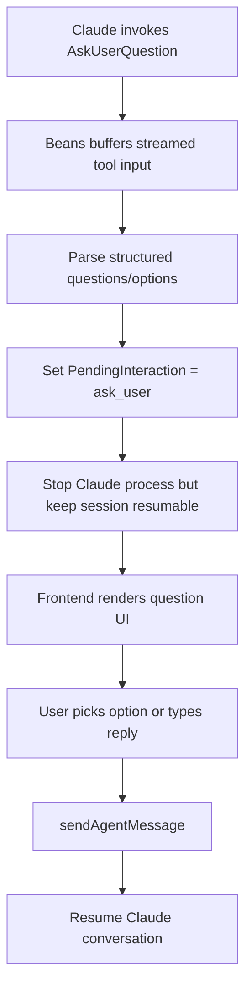

# Use-case: structured user questions

## What it is

Beans supports agent turns that must stop and ask the human for clarification, confirmation, or a choice.

Today this is implemented through Claude's `AskUserQuestion` tool.

## How Beans uses Claude for it

1. Claude begins a tool call named `AskUserQuestion`.
2. Beans does not immediately surface it; it waits until the streamed tool input is complete enough.
3. Beans parses the tool input JSON and extracts structured question data, including:
   - `header`
   - `question`
   - `multiSelect`
   - `options[]`
4. Beans sets a pending interaction on the session:
   - `PendingInteraction.Type = ask_user`
5. Beans signals the Claude process to stop, while keeping the session resumable.
6. The frontend renders a dedicated interaction panel instead of expecting the user to read plain-text questions in chat output.
7. When the user responds, the frontend sends a normal `sendAgentMessage` mutation back to the same session.

## Frontend behavior

The UI currently supports:

- single-select questions
- multi-select questions
- freeform typed responses

Response encoding is intentionally simple:

- single-select -> option label
- multi-select -> selected labels joined by `, `
- typed response -> raw text

There is no separate "answer interaction" RPC.

## Claude-specific behavior in this use-case

- The whole flow depends on the tool name `AskUserQuestion`.
- Beans knows the expected JSON structure of that tool input.
- The web UI assumes that plain-text questions are insufficient and that the Claude tool must be used for interactive prompts.

## Why it matters

This is one of the clearest examples where the UI contract is Claude-shaped. The backend and frontend are both expecting a specific Claude tool and a specific tool-input schema.

## Flow diagram

## Relevant files

- `internal/agent/claude.go`
- `internal/agent/parse.go`
- `internal/agent/types.go`
- `frontend/src/lib/components/PendingInteraction.svelte`
- `frontend/src/lib/agentChat.svelte.ts`
- `internal/commands/serve.go`

## Assessment against `meta/bjesuiter/03-spec/beans-agent-spec.md`

**Verdict:** directly solved and substantially simplified.

This is another use-case the new spec addresses head-on.

The spec replaces the Claude-specific `AskUserQuestion` flow with a generic interaction model:

- drivers emit `InteractionRequested`
- Beans stores requests in `PendingRequests`
- the UI renders those requests from session state
- the user's answer goes back through `Respond(requestID, reply)`

It also defines interaction kinds that map closely to the current needs:

- `select`
- `multi_select`
- `text_input`
- `confirm`
- `editor`
- `custom`

That removes the biggest current coupling points:

- no hard dependency on the tool name `AskUserQuestion`
- no dependency on Claude's tool-input JSON schema
- no need to overload ordinary user messages as implicit interaction replies

Implementation work remains in the drivers, because each runtime still has to map its native question/approval mechanism into Beans interactions. But architecturally, this use-case is much cleaner under the new spec.
