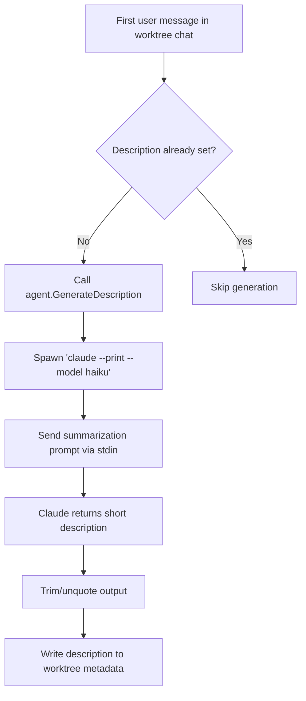

# Use-case: workspace description generation

## What it is

Beans uses Claude for a second, separate use-case outside the main chat runtime: generating a short description for a worktree workspace.

The goal is to summarize the first user message into a compact label for the workspace sidebar.

## How Beans uses Claude for it

1. `agentMgr.SetOnFirstUserMessage(...)` is registered in `internal/commands/serve.go`.
2. It only runs for worktree agents, not for the central `__central__` session.
3. When the first user message arrives for a worktree without a description, Beans calls:
   - `agent.GenerateDescription(message)`
4. `GenerateDescription` launches a separate Claude process:
   - `claude --print --model haiku`
5. Beans writes a summarization prompt to stdin.
6. The original message is truncated to 500 characters before prompting.
7. The returned text is trimmed, unquoted if necessary, and then written back into worktree metadata.

## Claude-specific behavior in this use-case

- This is a completely separate Claude integration from the streaming chat runner.
- It relies on the Claude CLI supporting `--print` and `--model haiku`.
- It is not routed through the persistent session model or the web chat protocol.

## Why it matters

Any attempt to replace the current Claude integration has to remember that Beans does not only use Claude for chat. It also uses Claude as a lightweight metadata generator.

## Flow diagram

## Relevant files

- `internal/commands/serve.go`
- `internal/agent/describe.go`
- `internal/worktree/*`

## Assessment against `meta/bjesuiter/03-spec/beans-agent-spec.md`

**Verdict:** not solved by the current spec.

This use-case sits outside the session abstraction that the new spec defines.

The spec covers:

- opening/resuming live agent sessions
- streaming events into canonical session state
- mode changes, interactions, and resume behavior

But workspace description generation is different:

- it is a one-off metadata generation call
- it does not use the persistent session model
- it does not go through the live chat event flow
- it currently runs as a separate helper invocation

The spec may still help indirectly by making the main chat integration cleaner and easier to swap, but it does not define a replacement for this helper-style "generate me a short description" operation.

So if Beans wants this capability to become runtime-agnostic too, it would likely need either:

- a separate abstraction for utility/model calls, or
- a small driver-adjacent helper interface outside the core live-session spec
