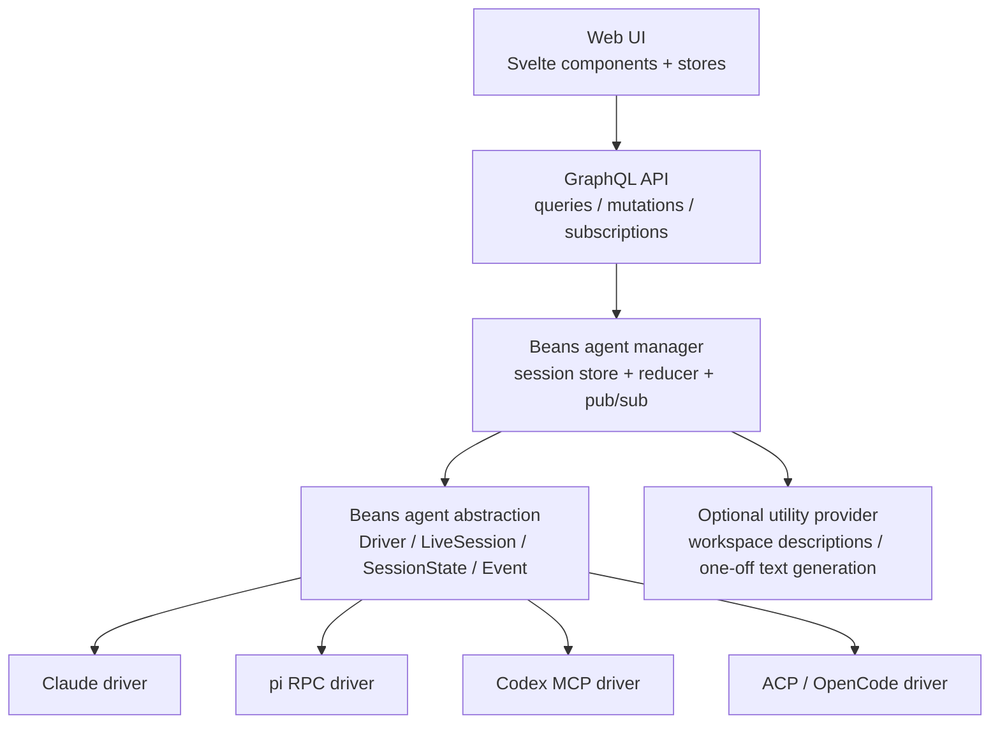

# Beans agent spec v2

A minimal Beans-native API for integrating different coding agents.

Companion note: see `./agent-spec-concepts.md` for the product-level concepts behind this API, including profiles, artifacts, actions, and the Beans-vs-driver layering rules.

Goals:

- one internal abstraction for Claude, pi RPC, Codex MCP, ACP/OpenCode
- one UI-facing session model
- interactions are session state, not host callbacks
- planning/worktree policy stays Beans-owned instead of leaking into drivers
- non-session helper calls stay possible without forcing them through the live chat model

---

## 0. Stack position



Reading it top to bottom:

- the Web UI only knows the GraphQL session model
- GraphQL talks to the Beans agent manager
- the manager owns the canonical session state and reduces driver events into it
- the abstraction is the boundary between Beans core and concrete agent runtimes
- each concrete driver adapts one external protocol/runtime into the same Beans model
- one-off helper calls like workspace description generation live beside the live-session API, not inside it

---

## 1. Design rules

1. Beans owns the session model.
2. Drivers adapt external protocols into Beans events.
3. The UI talks only to Beans session state and session actions.
4. User interactions are emitted as session events/state and answered later.
5. Host execution requirements are optional and driver-specific.
6. Session purpose and prompt policy are Beans product logic above the driver boundary.
7. Beans owns attachment persistence, artifact persistence, and cleanup rules.
8. The core should model what Beans already uses today; richer features should only be added when a real use-case needs them.

Rule 6 matters for the current `__central__` planner and worktree agents:

- the abstraction should support those sessions cleanly
- but it should **not** hard-code Beans planning policy into every driver

---

## 2. Core interfaces

```go
type Driver interface {
    Kind() string
    HostCapabilityRequirements() HostCapabilityRequirements
    Open(ctx context.Context, req OpenSessionRequest) (LiveSession, error)
    Resume(ctx context.Context, req ResumeSessionRequest) (LiveSession, error)
}

type LiveSession interface {
    Events() <-chan Event

    Send(ctx context.Context, input UserInput, opts SendOptions) error
    Cancel(ctx context.Context) error
    SetMode(ctx context.Context, modeID string) error
    Respond(ctx context.Context, requestID string, reply InteractionReply) error
    PerformAction(ctx context.Context, actionID string, input ActionInput) error

    Close(ctx context.Context) error
}
```

Notes:

- `SetMode` may be unsupported by a driver.
- `Respond` is for pending interaction requests.
- `PerformAction` is for optional runtime actions like compaction.
- unsupported features should be reflected in capabilities and/or exposed action lists rather than guessed by the UI.

---

## 3. Open/resume inputs

```go
type OpenSessionRequest struct {
    BeansSessionID string
    WorkingDir     string
    ProfileID      string // optional Beans-owned profile/policy ID
    InitialModeID  string // default: "act"
    Context        []ContentBlock
    Meta           map[string]any
}

type ResumeSessionRequest struct {
    BeansSessionID string
    WorkingDir     string
    ProfileID      string // optional Beans-owned profile/policy ID
    Resume         ResumeState
    Meta           map[string]any
}

type ResumeState struct {
    DriverKind string
    Opaque     map[string]any
}
```

`ResumeState` is adapter-owned.
Examples:

- Claude: session ID
- ACP: ACP session ID
- pi RPC: session file/session ID
- Codex MCP: thread ID

`ProfileID` is Beans-owned product policy, not a driver protocol concept.
Examples:

- `central_planner`
- `worktree_implementation`

Drivers may receive the resulting prompt/context through `Context` or `Meta`, but the decision to use those profiles belongs to Beans.

### 3.1 Session profiles and Beans-owned policy

The live-session abstraction should make room for Beans product policy without baking that policy into every driver.

```go
type SessionProfile struct {
    ID      string
    Prompt  []ContentBlock
    Meta    map[string]any
}
```

Rules:

- Beans chooses the profile from product context, not from driver behavior.
- `__central__` can map to a `central_planner` profile.
- bean worktree chats can map to a `worktree_implementation` profile.
- profiles may carry Beans-specific instructions such as "use `startWork` instead of runtime worktree-switch tools".
- drivers consume profile-derived `Context` / `Meta` as plain input; they should not hard-code special semantics for Beans profile IDs.
- worktree safety rules and prompt shaping remain Beans policy above the abstraction.

This is how v2 keeps central-planner and worktree-agent behavior while still removing Claude-shaped runtime coupling.

---

## 4. User input and content blocks

The live-session API should take a Beans-native input model instead of Claude `stream-json` envelopes or Anthropic-specific image blocks.

```go
type UserInput struct {
    Blocks []ContentBlock
    Meta   map[string]any
}

type ContentBlock interface {
    isContentBlock()
}

type TextBlock struct {
    Text string
}

type ImageBlock struct {
    Attachment AttachmentRef
    AltText    string
}

type AttachmentRef struct {
    ID        string
    Name      string
    MediaType string
    SizeBytes int64
}
```

Rules:

- Beans persists uploaded attachments before passing input to a driver.
- session history references attachments by durable Beans attachment IDs.
- drivers translate `ContentBlock` values into their native wire format.
- drivers do **not** own attachment lifecycle, serving URLs, or cleanup policy.
- image support is capability-driven; a driver that cannot handle images should expose that via `SessionCapabilities`.

This keeps multimodal input generic while preserving Beans-owned storage conventions.

### 4.1 Attachment lifecycle guidance

Attachment persistence is part of the Beans session model, not a driver-private concern.

Suggested persisted attachment record:

```go
type PersistedAttachment struct {
    ID               string
    BeansSessionID   string
    Name             string
    MediaType        string
    SizeBytes        int64
    StoragePath      string
    ReferencedByIDs  []string
}
```

Rules:

- Beans should persist attachment metadata and storage location before calling `Send(...)`.
- persisted messages should reference attachment IDs, not inline driver payloads.
- attachment serving URLs are derived from Beans persistence, not from driver state.
- cleanup may happen after compaction, clear-session, or message deletion, but the policy is owned by Beans.
- drivers should receive either bytes, local file paths, or driver-native upload handles prepared by Beans.

---

## 5. Session state

```go
type SessionState struct {
    BeansSessionID   string
    DriverKind       string
    ProfileID        string
    Status           SessionStatus
    WorkDir          string

    Capabilities     SessionCapabilities
    CurrentModeID    string
    AvailableModes   []Mode
    AvailableActions []SessionAction

    Messages         []Message
    ToolCalls        []ToolCall
    Artifacts        []Artifact
    PendingRequests  []InteractionRequest

    StatusText       string
    LastError        string
    Resume           *ResumeState
}
```

Notes:

- `ProfileID` captures Beans-owned product policy like central-planner vs worktree-agent.
- `CurrentModeID` replaces `planMode` / `actMode` booleans.
- `PendingRequests` replaces Claude-specific pending interaction state.
- `ToolCalls` remain because Beans already surfaces tool-like activity, diffs, and progress.
- `Artifacts` give Beans a generic home for documents like plans and derived diffs.
- `AvailableActions` lets the UI render capabilities like compact without sending magic chat messages.

### 5.1 Persistence envelope guidance

The persistence format should store Beans-owned canonical state separately from driver-owned resume data.

```go
type PersistedSessionEnvelope struct {
    Version        int
    BeansSessionID string
    DriverKind     string
    ProfileID      string
    Resume         *ResumeState
    Messages       []Message
    ToolCalls      []ToolCall
    Artifacts      []Artifact
    Meta           map[string]any
}
```

Rules:

- the persisted envelope version is Beans-owned and should be incremented when the on-disk model changes.
- legacy Claude-only sessions should be migrated lazily when loaded or next persisted.
- `Resume.Opaque` must be stored round-trip without Beans trying to normalize adapter-private fields.
- canonical history should preserve Beans messages, tool calls, and artifacts separately from driver-private continuation state.
- shutdown/clear behavior may remove live processes, but should not silently discard persisted canonical state unless the user explicitly clears it.

This resolves the v1 gap where persistence was effectively Claude-session-shaped.

---

## 6. Tool calls and activity rows

`ToolCalls` should be broad enough to model literal tool calls, delegated subagents, and background tasks.

```go
type ToolCall struct {
    ID       string
    Kind     ToolCallKind
    ParentID string

    Name     string
    Summary  string
    Status   ToolCallStatus

    Input    map[string]any
    Output   map[string]any
    Meta     map[string]any
}
```

Suggested `ToolCallKind` values:

- `tool`
- `subagent`
- `task`

This keeps the current UI's live activity feed possible without forcing the whole spec to become Claude `task_progress` shaped.

---

## 7. Artifacts and derived documents

Some session outputs are better modeled as durable artifacts than as plain messages.

```go
type Artifact struct {
    ID       string
    Kind     ArtifactKind
    Title    string
    Blocks   []ContentBlock
    Meta     map[string]any
}
```

Suggested `ArtifactKind` values:

- `plan`
- `diff`
- `file`
- `note`

Rules:

- drivers may emit artifacts directly
- Beans may also derive artifacts from tool calls, written files, or persisted session state
- worktree diff panes may be driven by derived `diff` artifacts rather than by runtime-specific write-event parsing in the UI
- plan review should prefer an explicit `plan` artifact over runtime-specific file discovery like `~/.claude/plans/...`
- artifact persistence and cleanup remain Beans responsibilities
- decisions about how much artifact or tool detail to show stay product-owned UI policy, not driver protocol

This gives plan approval and diff rendering a runtime-agnostic home.

---

## 8. Minimal event model

Drivers emit normalized events; Beans reduces them into `SessionState`.

Core events:

- `ResumeStateUpdated`
- `SessionStatusChanged`
- `ModesUpdated`
- `ActionsUpdated`
- `StatusTextUpdated`
- `MessageStarted`
- `MessageDelta`
- `MessageCompleted`
- `ToolCallStarted`
- `ToolCallUpdated`
- `ToolCallCompleted`
- `ArtifactUpserted`
- `ArtifactRemoved`
- `InteractionRequested`
- `InteractionResolved`
- `ErrorEvent`
- `SessionEnded`

Everything else should be added only when a real driver needs it.

---

## 9. Capabilities

### UI-facing session capabilities

```go
type SessionCapabilities struct {
    Resume      bool
    SetMode     bool
    CancelTurn  bool
    SendImages  bool
    ToolCalls   bool
    Artifacts   bool
    Interaction bool
    Actions     bool
}
```

### Backend-only host requirements

```go
type HostCapabilityRequirements struct {
    FileSystem  bool
    Terminal    bool
    Permissions bool
}
```

This is not core UI API.
It is backend plumbing for drivers like ACP.

---

## 10. Interactions

Interactions are session state, not synchronous host callbacks.

Flow:

1. driver emits `InteractionRequested`
2. Beans stores it in `PendingRequests`
3. UI renders it
4. user answers
5. Beans calls `Respond(requestID, reply)`

Suggested interaction shape:

```go
type InteractionRequest struct {
    ID          string
    Kind        string
    Title       string
    Prompt      []ContentBlock
    Options     []InteractionOption
    ArtifactIDs []string
    Meta        map[string]any
}
```

Interaction kinds should include:

- `permission`
- `confirm`
- `select`
- `multi_select`
- `text_input`
- `editor`
- `custom`

Plan approval should be modeled generically as a standard Beans convention:

- a `plan` artifact, plus
- an interaction such as `confirm`, `editor`, or `custom` that references that artifact

Drivers that support native planning flows should emit both sides explicitly:

- mode changes via `ModesUpdated` / `SetMode(...)`
- reviewable plan content via `ArtifactUpserted`
- approval/refinement requests via `InteractionRequested`

That keeps plan review in the spec without making the whole abstraction Claude `ExitPlanMode` shaped.

---

## 11. Modes

```go
type Mode struct {
    ID          string
    Name        string
    Description string
}
```

Rules:

- default mode is `act`
- if a driver has no native mode system, expose:
  - `currentModeId = "act"`
  - `availableModes = [act]`
  - `SetMode = false`
- plan approval is **not** a special mode by itself; it is a mode change plus artifacts/interactions when needed

This applies to pi RPC and Codex MCP.

---

## 12. Runtime actions

Some runtime behaviors are neither ordinary messages nor mode switches.

```go
type SessionAction struct {
    ID          string
    Name        string
    Description string
}

type ActionInput struct {
    Meta map[string]any
}
```

Rules:

- actions are optional and capability-driven
- the UI should only render actions listed in `AvailableActions`
- the first standardized action is `compact`
- action side effects like attachment pruning remain Beans-owned follow-up behavior

This replaces magic text commands like `/compact` with an explicit runtime action surface.

---

## 13. Optional utility provider for non-session calls

Some Beans features are not live chat sessions at all.
Workspace description generation is the clearest current example.

Instead of forcing those through `LiveSession`, define a separate optional helper interface:

```go
type UtilityProvider interface {
    GenerateText(ctx context.Context, req GenerateTextRequest) (GenerateTextResult, error)
}

type GenerateTextRequest struct {
    Purpose string
    Prompt  []ContentBlock
    Meta    map[string]any
}

type GenerateTextResult struct {
    Text string
    Meta map[string]any
}
```

Examples of `Purpose`:

- `workspace_description`
- `bean_title_suggestion`
- `summary`

Rules:

- this interface is optional and separate from `Driver`
- it is for one-off helper calls, not durable session state
- Beans may use the same runtime family for both live sessions and helper calls, but the abstractions stay separate

---

## 14. Driver mapping summary

### Claude
- native session + streaming adapter
- modes: `plan`, `act`
- actions: `compact`
- can emit plan artifacts and plan-review interactions
- utility provider can handle workspace description generation
- no host requirements

### pi RPC
- prompt/steer/follow_up mapping can be added later as optional delivery behavior
- always expose `act`
- actions optional
- utility provider optional
- no host requirements

### Codex MCP
- `codex` = open
- `codex-reply` = continue
- always expose `act`
- resume state is process-local thread ID
- actions optional
- utility provider optional
- no host requirements

### ACP / OpenCode
- session-based adapter
- may expose native modes
- may expose actions and artifacts
- requires host capabilities for FS / terminal / permissions
- permission requests still map into normal `InteractionRequested` state

---

## 15. Coverage of the current Beans use-cases

1. **Central planning agent**
   - covered by `ProfileID`, `WorkingDir`, and Beans-owned `Context`
   - the central planning prompt still exists, but now as Beans-owned profile policy
   - the decision that `__central__` is a coordinator session remains above the driver abstraction by design
   - instructions like "use `startWork`" stay product policy, not driver protocol
2. **Worktree implementation agent**
   - covered by `WorkingDir`, `ProfileID`, `ToolCalls`, and `Artifacts`
   - worktree safety rules remain profile/prompt policy
   - write-derived diffs can be surfaced as `diff` artifacts instead of runtime-specific UI parsing
   - the exact amount of tool detail shown stays a Beans UI decision
3. **Session persistence and resume**
   - covered by `ResumeState` and driver-owned opaque resume data
   - v2 also adds persistence-envelope guidance for versioning, lazy migration, and round-tripping opaque resume fields
4. **Multimodal message input**
   - covered by `UserInput`, `ContentBlock`, and `AttachmentRef`
   - v2 also adds attachment lifecycle guidance for persistence, serving, and cleanup
5. **Structured user questions**
   - covered by `InteractionRequested`, `PendingRequests`, and `Respond(...)`
6. **Plan mode and plan approval**
   - covered by generic modes plus `plan` artifacts and review interactions
   - plan review is now a first-class Beans convention rather than an implicit Claude-only file-discovery flow
7. **Conversation compaction**
   - covered by optional runtime actions, especially `compact`
   - attachment pruning remains a Beans-owned follow-up policy
8. **Subagent activity and system status**
   - covered by `StatusTextUpdated` and `ToolCall.Kind = subagent|task`
   - v2 explicitly distinguishes tool calls, delegated subagents, and generic background tasks
9. **Workspace description generation**
   - covered by the separate optional `UtilityProvider`
   - this keeps one-off helper calls runtime-agnostic without forcing them into session state

---

## 16. Remaining non-goals

This spec does **not** make Beans:

- ACP-shaped internally
- Claude-shaped internally
- a generic editor-host protocol implementation
- dependent on one runtime's prompt policy
- dependent on one runtime's attachment or plan-file layout

It also does **not** fully specify:

- GraphQL schema details
- JSONL persistence format versioning/migration
- exact attachment storage paths
- exact artifact retention policies

Beans remains a session manager and UI adapter with pluggable drivers and a small adjacent utility surface.