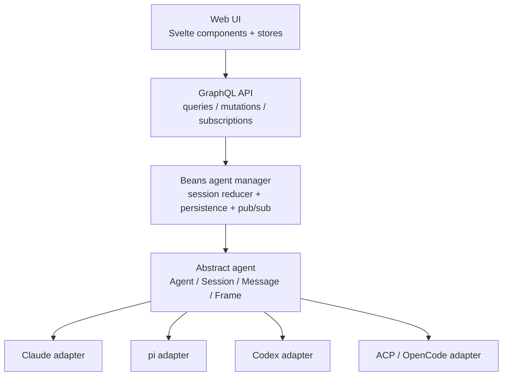

# Beans agent spec v2

A minimal Beans-native agent abstraction built around **sessions, messages, and frames**.

Companion note: see `./agent-spec-v2-concepts.md` for the reduced concept model and the Beans-vs-driver layering rules.

## Goals

- keep the abstract API surface as small as possible
- keep full expressability for Claude, pi, Codex, and ACP-style runtimes
- persist a durable Beans-owned conversation timeline
- support streaming output without exposing runtime-specific wire protocols
- keep Beans product policy outside the driver interface
- allow one-off helper calls to reuse the same runtime/subscription path when possible

---

## 0. Stack position



Reading it top to bottom:

- the UI knows only Beans session state
- the manager owns canonical persistence and reduction
- the abstract agent layer is intentionally small
- each concrete runtime maps to the same message/frame model

---

## 1. Design rules

1. Beans owns the durable session timeline.
2. Drivers adapt runtime protocols into Beans messages and frames.
3. The abstract interface should expose primitives, not product-specific workflows.
4. Tool calls, interactions, mode changes, actions, and artifacts should be represented through message/frame semantics rather than separate top-level APIs.
5. Resume data is driver-owned and opaque.
6. Profiles, prompts, worktree rules, attachment storage, and cleanup stay Beans-owned.
7. One-off helper calls should be possible without forcing them into the live-session model.
8. Derived UI state is allowed above the abstraction, but the abstraction itself should stay small.

---

## 2. Primitive model

The core abstraction should have only these runtime primitives:

- `Agent`
- `Session`
- `Message`
- `Frame`
- `ResumeToken`
- optional `OneShotCall`

Everything else is either:

- a frame semantic
- a Beans-owned policy
- or a derived UI/persistence view

---

## 3. Core interfaces

```go
type Agent interface {
    Kind() string
    Open(ctx context.Context, req OpenRequest) (Session, error)
    Resume(ctx context.Context, req ResumeRequest) (Session, error)
}

type OneShotAgent interface {
    Agent
    Call(ctx context.Context, req OneShotRequest) (OneShotResult, error)
}

type Session interface {
    Events() <-chan FrameEvent
    Send(ctx context.Context, msg OutboundMessage) error
    Close(ctx context.Context) error
}
```

Notes:

- `Agent` is the minimal live-session interface.
- `OneShotAgent` is an optional extension for helper calls like naming or description generation.
- separate methods like `SetMode`, `Respond`, `PerformAction`, and `Cancel` are intentionally omitted; those become message/frame semantics.
- unsupported semantics are expressed by driver behavior and Beans policy, not by expanding the core interface.

---

## 4. Open/resume inputs

```go
type OpenRequest struct {
    BeansSessionID string
    WorkingDir     string
    Context        []Frame
    Meta           map[string]any
}

type ResumeRequest struct {
    BeansSessionID string
    WorkingDir     string
    Context        []Frame
    Resume         ResumeToken
    Meta           map[string]any
}

type ResumeToken struct {
    DriverKind string
    Opaque     map[string]any
}
```

Rules:

- `ResumeToken` is opaque to Beans except for routing by `DriverKind`.
- `Context` carries Beans-owned prompt/context material without making prompts a first-class driver concept.
- profiles like `central_planner` or `worktree_implementation` are compiled by Beans into `Context` and `Meta`; they are not abstract-agent primitives.

---

## 5. Messages

A message is the durable unit of the session timeline.

```go
type Message struct {
    ID        string
    Role      MessageRole
    Frames    []Frame
    Meta      map[string]any
    CreatedAt time.Time
}

type OutboundMessage struct {
    ID     string
    Role   MessageRole
    Frames []Frame
    Meta   map[string]any
}
```

Suggested message roles:

- `user`
- `assistant`
- `system`
- `control`

Rules:

- Beans persists messages, not raw runtime transport packets.
- Beans may stream frames first and materialize/finalize messages incrementally.
- outbound control operations like cancel, set-mode, compact, or interaction replies are represented as outbound messages with control frames.
- a runtime may internally map one outbound message to multiple native protocol operations; that is driver behavior.

---

## 6. Frames

Frames are the expressive transport/update primitive.

A frame is a typed piece of message content or message-related state.

```go
type Frame struct {
    ID      string
    Type    string
    Phase   string
    Persist bool
    Data    map[string]any
}
```

Suggested `Phase` values:

- `point`
- `start`
- `delta`
- `end`

Rules:

- frames are intentionally generic and typed by `Type`.
- drivers emit frames; Beans reduces them into durable messages and derived views.
- some frames are persistable, some are ephemeral.
- this model is inspired by frame/part-based streaming systems such as the Vercel AI SDK custom message parts approach.

### 6.1 Standard frame semantics

The abstraction should standardize a small set of common frame `Type` values, while still allowing extensions.

Suggested standard types:

- `text`
- `attachment`
- `tool_call`
- `interaction_request`
- `interaction_response`
- `mode_change`
- `action`
- `artifact`
- `status`
- `error`

Notes:

- these are frame semantics, not separate top-level interface families.
- `attachment` frames should usually be treated as rich references to Beans-owned persisted data, not raw inlined blobs. In practice they normally carry handles such as attachment IDs, media type, file name, size/hash metadata, or a local lookup path.
- a driver may emit additional driver-specific frame types if Beans chooses to support them.
- Beans may also derive additional non-driver frames during reduction, e.g. derived diff artifacts.

### 6.2 Examples

Normal user message:

```json
{
  "role": "user",
  "frames": [
    { "type": "text", "phase": "point", "persist": true, "data": { "text": "Please inspect this bean" } }
  ]
}
```

User message with image:

```json
{
  "role": "user",
  "frames": [
    { "type": "text", "phase": "point", "persist": true, "data": { "text": "What is in this screenshot?" } },
    { "type": "attachment", "phase": "point", "persist": true, "data": { "attachmentId": "att_123", "mediaType": "image/png" } }
  ]
}
```

Control message to change mode:

```json
{
  "role": "control",
  "frames": [
    { "type": "mode_change", "phase": "point", "persist": true, "data": { "modeId": "plan" } }
  ]
}
```

Control message to compact:

```json
{
  "role": "control",
  "frames": [
    { "type": "action", "phase": "point", "persist": true, "data": { "actionId": "compact" } }
  ]
}
```

Interaction reply:

```json
{
  "role": "user",
  "frames": [
    { "type": "interaction_response", "phase": "point", "persist": true, "data": { "requestId": "req_1", "value": "yes" } }
  ]
}
```

---

## 7. Frame events

Sessions stream frames back to Beans.

```go
type FrameEvent struct {
    MessageID   string
    MessageRole MessageRole
    Frame       Frame
}
```

Rules:

- frame events are the live streaming surface.
- Beans reduces frame events into persisted messages.
- multiple frame events may contribute to one message.
- a driver may start a new message implicitly by emitting a new `MessageID`.
- Beans may publish both raw frame streams and reduced state to higher layers, but persistence should remain message-oriented.

---

## 8. Persisted vs ephemeral frames

Not every streamed frame belongs in durable history.

Persistable examples:

- final text content
- tool call inputs/outputs worth showing in history
- interaction requests/responses
- mode changes
- actions like compact
- artifact references
- meaningful errors

Ephemeral examples:

- typing pulses
- transient thinking indicators
- low-level progress ticks
- status text that is only useful while a turn is running
- deltas that are later compacted into a final persisted frame

Rules:

- `Persist` is a hint from the driver/adapter layer.
- Beans may still normalize or compact frames before persistence.
- persisted history should optimize for durable meaning, not raw transport fidelity.

---

## 9. Canonical session state

The minimal persisted session state does not need top-level tool-call, interaction, or artifact lists.

```go
type SessionState struct {
    BeansSessionID string
    DriverKind     string
    WorkDir        string
    Status         SessionStatus
    Messages       []Message
    Resume         *ResumeToken
    LastError      string
}
```

Derived views such as these are allowed above the abstraction:

- current mode
- pending interactions
- live tool activity
- artifact lists
- diff panels
- available controls

These are Beans-side projections computed from persisted messages and streamed frames, sometimes combined with extra Beans knowledge such as attachment storage or git diff state.

But those should be computed from messages/frames, not added as mandatory abstract-agent primitives.

---

## 10. Derived Beans concepts

The following are still useful in Beans, but they are no longer first-class abstract-agent primitives:

- profiles
- modes
- actions
- interactions
- tool calls
- artifacts
- attachments
- live status rows

In v2 they are represented as either:

- frame semantics
- Beans persistence/storage rules
- or derived UI state

This is the main reduction in API surface.

---

## 11. One-shot calls

Some work is not part of a durable live session timeline.

Examples:

- generate a workspace description from the first user message
- generate a short session name
- summarize content for metadata

That belongs in an optional one-shot interface, not in the live-session API.

```go
type OneShotRequest struct {
    Purpose string
    Frames  []Frame
    Meta    map[string]any
}

type OneShotResult struct {
    Frames []Frame
    Meta   map[string]any
}
```

Rules:

- a one-shot call may reuse the same underlying runtime/driver and therefore the same user subscription/payment path.
- it is separate from `Session` because it does not create durable chat state unless Beans explicitly persists the result.
- the old `UtilityProvider` idea collapses into this optional one-shot capability.

---

## 12. Beans-owned policy outside the abstraction

The following remain explicitly outside the abstract-agent interface:

- profile selection like `central_planner` vs `worktree_implementation`
- prompt construction and workflow instructions
- the decision that `__central__` is a coordinator session
- the instruction to use Beans `startWork`
- attachment storage paths and serving URLs
- attachment cleanup after compaction or clear-session
- artifact retention policy
- GraphQL schema design
- UI rendering decisions

The driver receives context and emits frames.
Beans owns the product.

---

## 13. Driver mapping summary

### Claude
- maps Claude stream-json input/output into outbound messages and inbound frame events
- Claude tool use becomes `tool_call` frames
- `AskUserQuestion` becomes `interaction_request` frames
- plan/act transitions become `mode_change` frames
- `/compact` replacement becomes an `action` frame
- resumability lives in `ResumeToken.Opaque`
- one-shot naming/description generation can use `Call(...)`

### pi
- maps pi session transport into the same message/frame model
- may expose only `act`-like behavior through accepted/rejected control frames
- resumability lives in `ResumeToken.Opaque`
- one-shot helper generation can reuse the same runtime path

### Codex
- maps open/continue semantics into session open/resume
- message streaming becomes frame events
- resumability lives in `ResumeToken.Opaque`

### ACP / OpenCode
- maps host/editor/runtime events into the same frame model
- permission prompts become `interaction_request` frames
- delegated work can become `tool_call` or custom frames
- resumability lives in `ResumeToken.Opaque`

---

## 14. Coverage of current Beans use-cases

1. **Central planning agent**
   - represented by Beans-owned context injected into `OpenRequest.Context`
   - no special driver primitive required
2. **Worktree implementation agent**
   - represented by `WorkingDir` plus Beans-owned context
3. **Session persistence and resume**
   - represented by persisted `Messages` plus opaque `ResumeToken`
4. **Multimodal message input**
   - represented by `text` and `attachment` frames
5. **Structured user questions**
   - represented by `interaction_request` and `interaction_response` frames
6. **Plan mode and plan approval**
   - represented by `mode_change`, `artifact`, and interaction frames
7. **Conversation compaction**
   - represented by a control message with an `action` frame
8. **Subagent activity and system status**
   - represented by `tool_call` and `status` frames
9. **Workspace description generation**
   - represented by optional `Call(...)`

---

## 15. Non-goals

This spec does **not** make Beans:

- Claude-shaped internally
- ACP-shaped internally
- dependent on runtime-specific tool names
- dependent on runtime-specific plan file locations
- dependent on a large method surface on `Session`

This spec also does **not** fully specify:

- exact GraphQL schema shape
- exact frame payload schemas for every standard type
- exact on-disk JSONL format
- exact attachment storage structure
- exact derived-view algorithms for modes, tools, interactions, or artifacts

Those can evolve above the minimal abstraction.

---

## 16. Short version

If a future feature can be expressed as:

- a new frame type
- a new frame payload
- or a Beans-side derived view over messages

then it should usually **not** expand the abstract-agent method surface.

That is the core idea of spec v2.