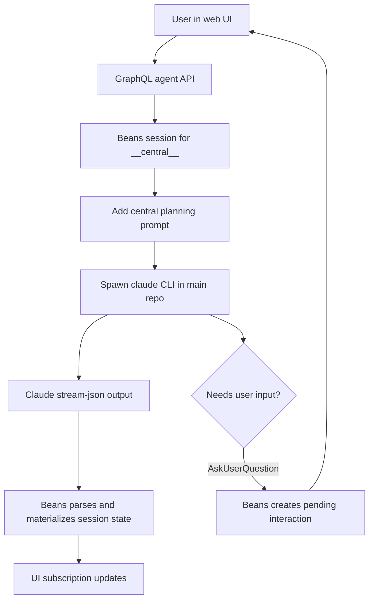

# Use-case: central planning agent

## What it is

Beans has a special central agent session with the ID `__central__`. This is the planning and coordination agent for the main repository.

It is not meant to implement bean work directly. Instead, it helps the user:

- create and refine beans
- organize backlog structure
- prioritize and relate work
- start implementation work by creating worktrees

## How Beans uses Claude for it

1. The web UI talks to the generic GraphQL agent API:
   - `agentSession(beanId)`
   - `sendAgentMessage(beanId, message, images)`
   - `stopAgent(beanId)`
2. For `beanId == __central__`, Beans creates an agent session whose working directory is the main repo.
3. When the session needs a Claude process, Beans spawns the `claude` CLI directly.
4. The first message is prefixed with a central planning prompt from `internal/commands/serve.go`.
5. That prompt tells Claude to:
   - behave as the planning agent
   - avoid Claude's built-in worktree tools
   - use Beans GraphQL `startWork` instead
   - use `AskUserQuestion` instead of plain-text questions
6. Claude output is parsed from `stream-json` stdout and materialized into the shared session state used by GraphQL subscriptions.

## Claude-specific behavior in this use-case

- Beans depends on Claude CLI process spawning.
- Beans depends on Claude `stream-json` stdin/stdout.
- The prompt explicitly references Claude-specific tools such as `EnterWorktree` and `AskUserQuestion`.
- Interactive questions only work because Beans intercepts Claude tool calls and turns them into UI interactions.

## Why this is a distinct use-case

The central agent is different from worktree agents because it is a coordination surface, not a coding surface. Its Claude prompt and allowed behavior are specialized for planning.

## Flow diagram

## Relevant files

- `internal/commands/serve.go`
- `internal/agent/manager.go`
- `internal/agent/claude.go`
- `internal/graph/schema.graphqls`
- `frontend/src/lib/components/AgentChat.svelte`

## Assessment against `meta/bjesuiter/05-spec-v2/beans-agent-spec-v2.md`

**Verdict:** mostly matched, with the remaining complexity intentionally left to Beans policy.

Spec v2 fits this use-case well at the abstraction boundary:

- the central planner is just a normal session opened with `WorkingDir` set to the main repo
- the central planning prompt can be compiled by Beans into `OpenRequest.Context`
- Claude-specific structured prompts like `AskUserQuestion` map to `interaction_request` frames
- streamed planning output, tool activity, and status all fit the message/frame model
- the UI can derive pending interactions and activity from frames instead of depending on Claude tool names

What v2 intentionally does **not** solve is the product meaning of the central agent:

- Beans still decides that `__central__` is a coordinator session
- Beans still owns the planning prompt and workflow rules
- instructions like using `startWork` instead of runtime-native worktree tools remain Beans policy, not abstract-agent behavior

So compared with the old Claude-shaped integration, v2 is a strong match for the runtime protocol side of this use-case, while deliberately keeping the planning semantics above the abstraction.