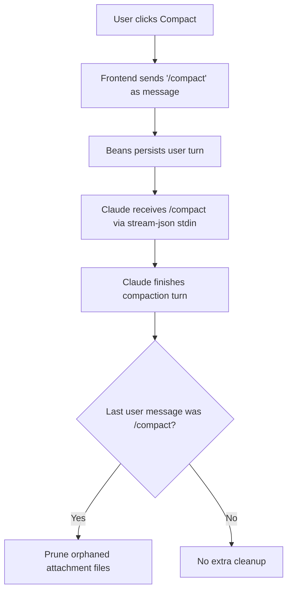

# Use-case: conversation compaction

## What it is

Beans lets the user compact an agent conversation from the web UI.

Today this is implemented as a Claude text command, not as a dedicated API.

## How Beans uses Claude for it

1. The frontend Compact control sends a normal user message:
   - `/compact`
2. Beans persists that message like any other user turn.
3. The message is sent to Claude through the standard `stream-json` stdin flow.
4. Claude handles the compaction internally.
5. When the turn completes, Beans checks whether the last user message was `/compact`.
6. If so, Beans prunes orphaned attachment files that are no longer referenced by persisted messages.

## Claude-specific behavior in this use-case

- Compaction is triggered by the literal command `/compact`.
- There is no separate GraphQL mutation like `compactAgentSession`.
- Beans assumes Claude understands that command and performs compaction semantics behind the scenes.

## Side effect: attachment cleanup

Compaction has a Beans-specific follow-up behavior:

- attachments live under `.beans/.conversations/attachments/<beanID>/`
- after compaction, Beans removes attachment files not referenced by any remaining persisted message

So the user-visible compact action is part Claude behavior and part Beans persistence hygiene.

## Flow diagram

## Relevant files

- `frontend/src/lib/components/AgentChat.svelte`
- `internal/agent/claude.go`
- `internal/agent/store.go`
- `meta/bjesuiter/01-research/claude-code-touchpoints.md`

## Assessment against `meta/bjesuiter/05-spec-v2/beans-agent-spec-v2.md`

**Verdict:** directly covered, with cleanup intentionally left on the Beans side.

This use-case is a much better fit in v2 than in the older spec because compaction no longer needs to be a magic plain-text command.

In v2:

- the frontend can send a control message with an `action` frame
- the adapter can map that to whatever compaction mechanism the runtime supports
- the durable timeline can record that the action happened without pretending it was normal user chat text

That removes the biggest current oddity:

- Beans no longer has to rely on a literal `/compact` message being understood by Claude

The remaining non-runtime behavior still belongs to Beans:

- pruning orphaned attachments
- deciding whether the action itself is persisted visibly in the transcript
- choosing how unsupported actions are shown in the UI

So the abstract protocol fit is good. The follow-up storage hygiene remains product logic, which is exactly where it belongs.