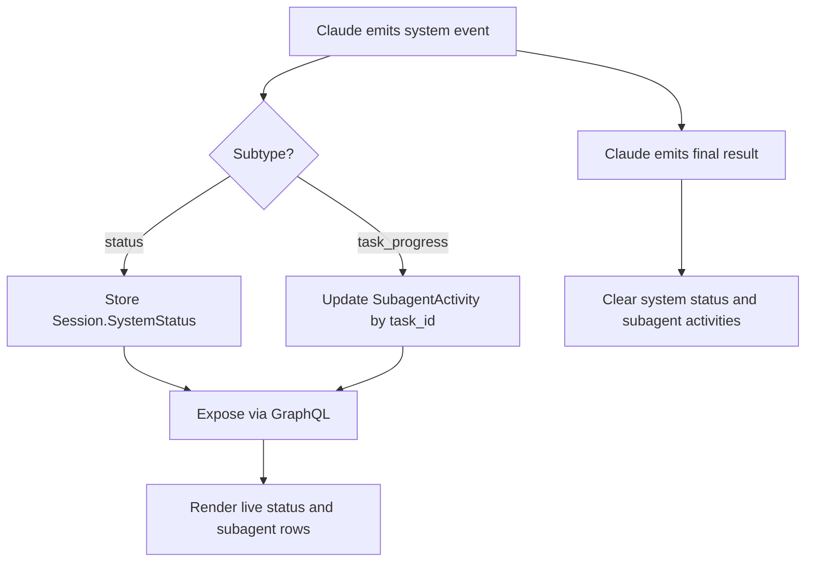

# Use-case: subagent activity and system status

## What it is

Beans shows live agent activity while Claude is running, including a high-level status string and per-subagent progress rows.

## How Beans uses Claude for it

### System status

1. Claude may emit a top-level `system` event with subtype `status`.
2. Beans stores the status text on `Session.SystemStatus`.
3. GraphQL exposes it as `systemStatus`.
4. The frontend uses it to show activity text such as a current phase instead of a generic thinking phrase.

### Subagent activity

1. Claude may emit a top-level `system` event with subtype `task_progress`.
2. Beans parses fields like:
   - `task_id`
   - `description`
   - `last_tool_name`
3. Beans updates or creates a `SubagentActivity` entry keyed by `task_id`.
4. GraphQL exposes the list as `subagentActivities`.
5. The chat UI renders these as live progress items while the session is running.

### Turn completion

When Claude emits a final `result`, Beans clears:

- `SystemStatus`
- `SubagentActivities`

and returns the session to idle.

## Claude-specific behavior in this use-case

- Beans assumes Claude emits `system.status` events.
- Beans assumes Claude emits `system.task_progress` events.
- The shape of `SubagentActivity` is derived from Claude's event payload, not from a generic activity model.

## Why it matters

This is another place where generic API naming hides Claude-specific semantics. The UI looks generic, but the live activity feed is built from Claude event types and Claude progress payloads.

## Flow diagram

## Relevant files

- `internal/agent/parse.go`
- `internal/agent/claude.go`
- `internal/agent/types.go`
- `internal/graph/agent_helpers.go`
- `frontend/src/lib/components/AgentChat.svelte`

## Assessment against `meta/bjesuiter/05-spec-v2/beans-agent-spec-v2.md`

**Verdict:** mostly matched, with the remaining nuance pushed into derived views.

V2 fits this use-case well because live activity is no longer a special Claude-shaped state bucket:

- `status` frames can carry the high-level activity text
- `tool_call` frames can represent delegated work and ongoing execution
- Beans can derive status rows and subagent lists from the message/frame stream rather than depending on Claude `system.status` and `task_progress` payloads directly

This is a good match for the current product need because the UI really wants a projection like:

- current headline status
- active delegated tasks
- maybe a recent activity history

Those are exactly the kind of Beans-side derived views v2 is designed to support.

The remaining gap is semantic precision, not interface shape:

- when should a `tool_call` frame be shown as a "subagent" versus just a tool row?
- how much transient activity should be persisted?
- do we need stricter conventions for task IDs, parent relationships, or completion states?

So v2 covers the abstraction well; the remaining work is mostly about how Beans interprets and presents live activity, not about missing protocol primitives.