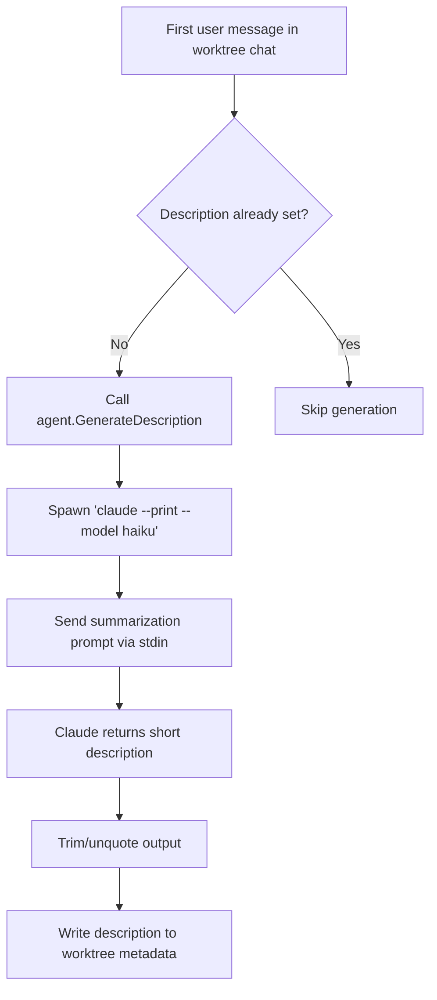

# Use-case: workspace description generation

## What it is

Beans uses Claude for a second, separate use-case outside the main chat runtime: generating a short description for a worktree workspace.

The goal is to summarize the first user message into a compact label for the workspace sidebar.

## How Beans uses Claude for it

1. `agentMgr.SetOnFirstUserMessage(...)` is registered in `internal/commands/serve.go`.
2. It only runs for worktree agents, not for the central `__central__` session.
3. When the first user message arrives for a worktree without a description, Beans calls:
   - `agent.GenerateDescription(message)`
4. `GenerateDescription` launches a separate Claude process:
   - `claude --print --model haiku`
5. Beans writes a summarization prompt to stdin.
6. The original message is truncated to 500 characters before prompting.
7. The returned text is trimmed, unquoted if necessary, and then written back into worktree metadata.

## Claude-specific behavior in this use-case

- This is a completely separate Claude integration from the streaming chat runner.
- It relies on the Claude CLI supporting `--print` and `--model haiku`.
- It is not routed through the persistent session model or the web chat protocol.

## Why it matters

Any attempt to replace the current Claude integration has to remember that Beans does not only use Claude for chat. It also uses Claude as a lightweight metadata generator.

## Flow diagram

## Relevant files

- `internal/commands/serve.go`
- `internal/agent/describe.go`
- `internal/worktree/*`

## Assessment against `meta/bjesuiter/05-spec-v2/beans-agent-spec-v2.md`

**Verdict:** directly covered by the optional one-shot capability.

This use-case is one of the reasons v2 includes `OneShotAgent.Call(...)`.

It maps well because workspace description generation is:

- not a durable conversation
- not part of the live frame stream
- a small helper task driven by existing runtime capabilities

V2 gives it a clean home:

- Beans can issue a one-shot request with frames derived from the first user message
- the adapter can call the underlying runtime directly
- Beans can reuse the same user subscription/payment path when the helper runs on the same provider/runtime family
- the result can be persisted into workspace metadata only if Beans chooses to do so

The remaining detail is mostly convention-level:

- which `Purpose` values should be standardized?
- what result frame shape is preferred for short metadata strings?
- should one-shot calls share logging/auditing behavior with sessions?

But unlike the older spec, v2 clearly has a place for this use-case without forcing it into the live-session API.